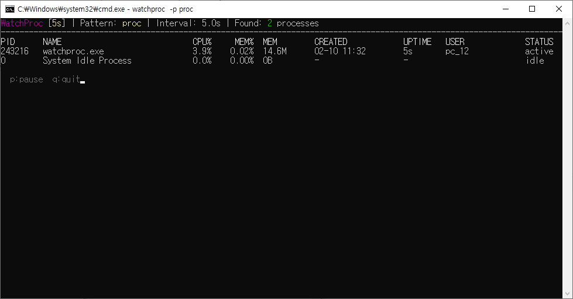

# WatchProc

A lightweight, real-time process monitoring tool for the terminal. Like `top` or `htop`, but focused on filtering and watching specific processes with a clean, color-coded display.



## Features

- **Live refresh** with configurable interval
- **Process filtering** by name (partial or exact match)
- **Sortable** by CPU, memory, PID, name, or uptime
- **Top-N mode** to show only the top consumers
- **Color-coded** CPU and memory usage (green/yellow/red)
- **Responsive layout** that adapts to terminal width
- **Pause/resume** with scrollable snapshot on pause
- **Cross-platform** support (Windows, Linux, macOS)

## Installation

### From source

```bash
go install github.com/BrianMSon/watchproc@latest
```

### Build manually

```bash
git clone https://github.com/BrianMSon/watchproc.git
cd watchproc
go build -o watchproc .
```

## Usage

```
watchproc [options] [pattern]
```

### Options

| Flag | Default | Description |
|------|---------|-------------|
| `-p` | `""` | Process name pattern (partial match) |
| `-e` | `false` | Exact name match |
| `-s` | `cpu` | Sort by: `cpu`, `mem`, `pid`, `name`, `time` |
| `-d` | `true` | Descending order |
| `-top` | `0` | Show only top N processes (0 = all) |
| `-n` | `5.0` | Refresh interval in seconds |
| `-no-header` | `false` | Hide header |

### Keyboard Shortcuts

| Key | Action |
|-----|--------|
| `p` / `Space` | Pause / Resume |
| `q` | Quit (prints last snapshot) |

## Examples

```bash
# Monitor all processes, sorted by CPU usage
watchproc

# Watch processes matching "chrome"
watchproc -p chrome

# Exact match for "nginx"
watchproc -p nginx -e

# Top 10 memory consumers
watchproc -s mem -top 10

# Watch Java processes, refresh every second
watchproc -p java -n 1

# Sort by PID, ascending order
watchproc -s pid -d=false
```

## Output

```
WatchProc [2m30s] | Pattern: node | Interval: 5.0s | Found: 3 processes
---------------------------------------------------------------------------------------
PID      NAME                   CPU%     MEM%  MEM        CREATED        UPTIME   USER       STATUS
12345    node                   12.3%    2.45%  512.0M    02-09 14:30    3h25m    brian      active
12400    node                    0.5%    1.20%  245.2M    02-09 15:00    2h55m    brian      idle
12678    node                    0.0%    0.80%  163.8M    02-09 16:20    1h35m    brian      idle
```

### Color Coding

**CPU usage:**
- Green: > 5%
- Yellow: > 20%
- Red: > 50%

**Memory usage:**
- Green: > 1%
- Yellow: > 5%
- Red: > 10%

## Responsive Layout

The display automatically adapts to your terminal width. The header progressively shortens when the terminal is narrow, and column widths (NAME, CREATED, USER) scale dynamically while fixed-width columns (PID, CPU%, MEM%, MEM, UPTIME, STATUS) remain constant.

## Requirements

- Go 1.21 or later

## License

[Apache License 2.0](LICENSE)
